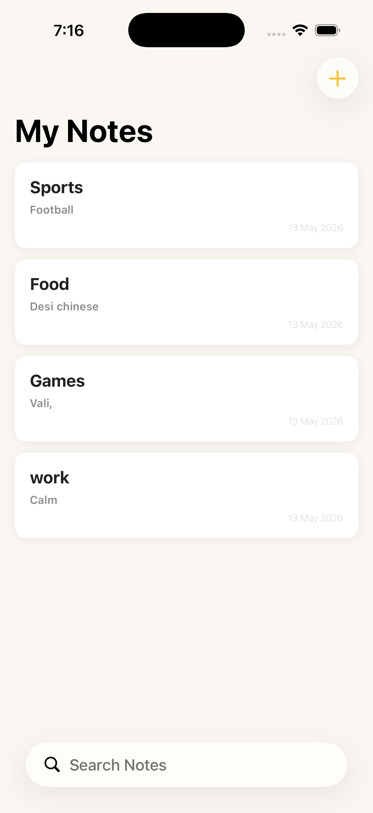
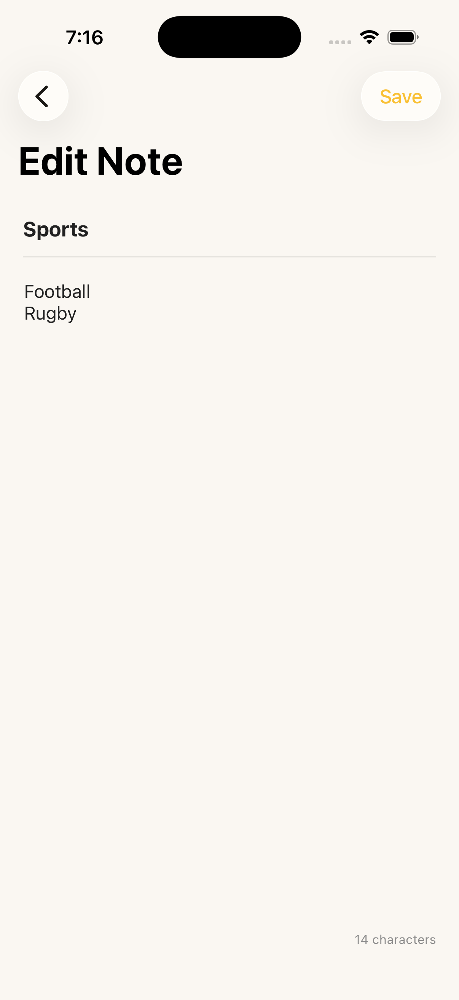
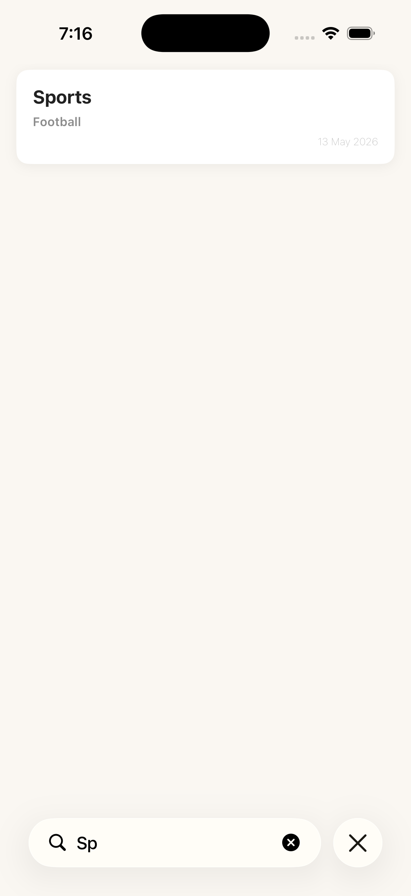

# 📝 NotesApp — iOS Notes App
> App #4 of my iOS Development Journey | Built with Swift + UIKit | Zero Storyboards
 
## 📱 Overview
A fully programmatic iOS notes app with CoreData persistence, real-time search, and a single editor screen handling both create and edit modes.
 
---
 
## 🖥️ Screenshots
 
| Note List | Note Editor | Search |
|---|---|---|
|  |  |  |
 
---
 
## 🖥️ Screens
- **Note List** — Custom `NoteCell` (title, preview, date) · swipe-to-delete · live search · empty state · `viewWillAppear` re-fetch
- **Note Editor** — Title + body · create/edit mode via `existingNote?` · live character count · save syncs CoreData
## ⚙️ Features
| Feature | Detail |
|---|---|
| CoreData persistence | Notes saved locally across launches |
| Dual-mode editor | Single VC handles create & edit via optional |
| Live search | `UISearchController` · `allNotes` + `filteredNotes` |
| Character count | Live label updates as user types |
| Global styling | Warm Minimal palette via `AppColors` + `SceneDelegate` |
 
## 🛠️ Tech Stack
Swift · UIKit · Programmatic UI · CoreData · `NSFetchRequest` · `UISearchController` · Singleton (`CoreDataManager`) · `UINavigationController`
 
## 🧠 Concepts Practiced
CoreData stack · `NSManagedObject` · `NSFetchRequest` · `viewContext` save · Dual-mode VC · `UISearchController` · Dual array filtering · `UITextView` · Character count · `viewWillAppear` refresh · Swipe to delete
 
## 🚀 Getting Started
```bash
git clone https://github.com/vermagagan/NotesApp-iOS.git
```
Open `NotesApp.xcodeproj` in Xcode · Run on iOS 16+ · No dependencies.
 
## 👨‍💻 Author
**vermagagan** · Aspiring iOS Developer · Building in public
[](https://linkedin.com/in/vermagagan) [](https://github.com/vermagagan)
 
> *"CoreData persistence, a dual-mode editor, live search filtering, and zero storyboards."*
